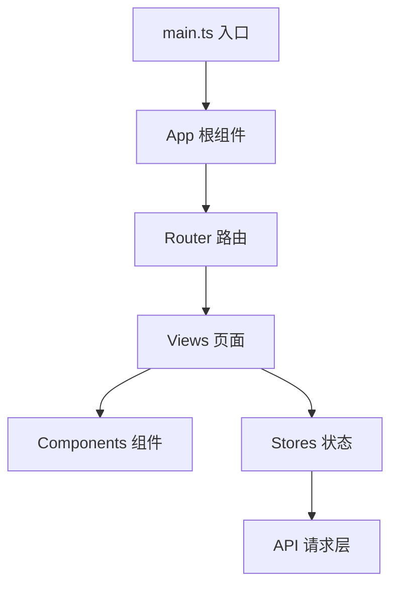
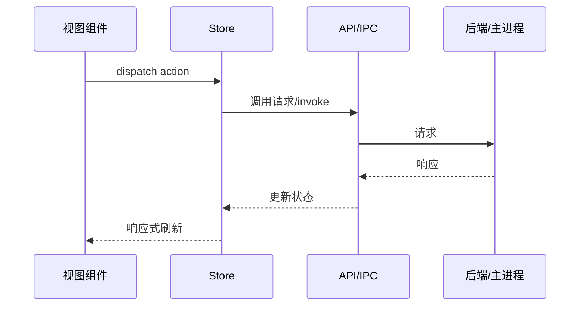

# 输出模板：PROJECT_OVERVIEW.md

生成文档时遵循下面的结构。**根据扫描模式裁剪**：快速模式可省略「数据流与通信」「代码约定」两节（或只给一句话占位）；深度模式补全。带 `（深度）` 标记的小节仅深度模式输出。

所有推断性内容若不确定，明确标注 `> ⚠️ 待与团队确认`。Mermaid 图按项目实际情况绘制，不要照搬样例数据。

---

## 模板结构

```markdown
# 项目速览：<项目名>

> 本文档由 project-onboarding 技能生成于 <日期> ｜ 扫描模式：<快速 / 深度>
> 目的：帮助快速理解项目结构与逻辑，明确新功能落点。推断内容已标注「待确认」。

## 1. 一句话概览

<这个项目是什么、给谁用、解决什么问题——3 句以内>

- **项目类型**：<如 Tauri 桌面应用 / Vue3 SPA / FastAPI 后端>
- **技术栈**：<核心框架 + 语言 + 关键库>
- **当前状态**：<能从 README/CHANGELOG/版本号看出的阶段，可选>

## 2. 怎么跑起来

- **环境要求**：<Node 版本 / 语言版本 / 其他前置>
- **安装**：`<install 命令>`
- **开发**：`<dev 命令>`
- **构建**：`<build 命令>`
- **其他常用脚本**：<test / lint / 打包等>

## 3. 技术栈与关键依赖

| 类别 | 选型 | 说明 |
|------|------|------|
| 框架 | | |
| 语言 | | |
| 状态管理 | | |
| 路由 | | |
| UI 库 | | |
| 请求/通信 | | |
| 构建工具 | | |
| 桌面/移动壳（如有） | | |

## 4. 业务需求理解

<基于 README / docs / 路由名 / i18n 推断的业务。讲清核心功能有哪几块、各自做什么。>

- 核心功能模块：
  1. <模块 A>：<做什么>
  2. <模块 B>：<做什么>

> ⚠️ 以下为推断，待与团队确认：<列出不确定项>

## 5. 目录结构

<目录树，已忽略 node_modules / dist / 构建产物。为每个核心目录加职责注释。>

```
src/
├── router/      # 路由表，页面映射的真相来源
├── stores/      # 全局状态（Pinia）
├── views/       # 页面级组件
├── components/  # 复用组件
├── api/         # 接口请求封装
└── ...
```

### 模块结构图



## 6. 入口与路由

- **入口文件**：<路径，说明它做了什么>
- **（桌面应用）主进程入口 / 渲染进程入口**：<分别说明>
- **路由表位置**：<路径>

| 路由 / 页面 | 对应文件 | 业务含义 |
|------|------|------|
| /xxx | views/Xxx | |

## 7. 功能模块分块

| 模块 | 位置 | 职责 |
|------|------|------|
| 状态管理 | | |
| API 层 | | |
| 工具函数 | | |
| 类型定义 | | |
| ... | | |

## 8. 数据流与通信（深度）

<状态如何流转、API 如何调用、与后端/IPC 如何通信。桌面应用重点讲清前后端边界。>



## 9. 代码约定与规范（深度）

- **命名规范**：<组件/文件/变量命名风格>
- **代码风格**：<ESLint/Prettier 配置要点>
- **提交规范**：<是否有 commitlint / 约定式提交>
- **目录组织约定**：<按 feature 还是按 layer>

## 10. ⭐ 新功能落点指南

<本文档最重要的部分。针对本项目类型，给出具体到本项目文件路径的「加新功能标准动作」。>

### 场景：新增一个页面/视图
1. 在 `<具体目录>` 新建组件，参照现有的 `<某个真实文件路径>`
2. 在 `<路由文件>` 注册路由
3. 在 `<导航/菜单文件>` 加入口
4. 如需数据，在 `<api 文件>` 加请求、`<store 文件>` 加状态

### 场景：新增一个接口调用
1. 在 `<api 目录>` 加方法（参照 `<现有真实文件>`）
2. 在 `<types 目录>` 定义类型
3. 在组件/store 中消费

### 场景：<该项目类型特有的落点，如 Tauri 加 command / Electron 加 IPC>
1. ...

> 提示：动手前，先找到一个最接近你要做的功能的现有实现，照着它的链路改，最稳妥。

## 11. 上手建议 / 注意事项

- <最重要的 1-3 条上手提示，如「先跑通 dev 再说」「注意 X 配置」「Y 模块有坑」>
- <已发现但未深究的疑点，留给读者后续探索>
```

---

## 生成要点

- **章节可裁剪**：小项目不必硬凑十一节；没有的内容直接省略对应节，别填无意义占位。
- **表格优先**：技术栈、路由映射、模块分块用表格，程序员扫读快。
- **落点指南必须具体**：第 10 节出现的路径必须是本项目真实存在的文件，不能是占位符。这是质量分水岭。
- **Mermaid 必画**：至少一张结构图；深度模式至少再加一张数据流/通信图。
- **语言**：与用户保持一致（中文用户用中文，代码标识符保留原文）。
