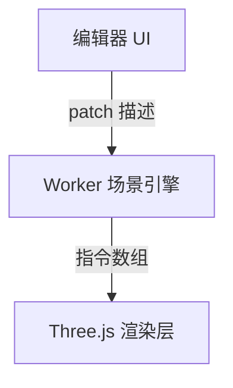

# 四件套输出模板

全部写到 `<知识库>/projects/<项目名>/`。模板里的 `<>` 为占位，实际写入时替换；写不出来的字段保留 `TODO(待补充)` 而不是删掉——缺口本身也是信息。

---

## 1. `INSIGHTS.md` —— 给人读的知识复盘

```markdown
# <项目显示名> · 技术复盘

> 复盘日期 <YYYY-MM-DD> ｜ 项目周期 <YYYY-MM ~ YYYY-MM> ｜ 我的角色 <角色>
> 一句话：<这个项目本质上解决了什么问题>

## 0. 我在其中做了什么

<两三句，主语是「我」。负责的模块、贡献占比及其依据。>

贡献依据：<git 统计 / 用户说明>

## 1. 架构全景

<Mermaid 图：模块边界与依赖方向，不要画成目录树——画数据与控制流。>



**架构上最重要的一个决定是**：<一句话点题，后面在第 2 节展开>

## 2. 技术主题（每题四层，3–6 个）

### 主题一：<起个有信息量的标题，不要叫「性能优化」>

- **L0 事实**：<技术栈与关键 API>
- **L1 机制**：<怎么工作的。原理、算法、数据结构、时序。这一层要具体到能画出来。>
- **L2 决策**：<为什么这么选；评估过什么方案、为什么否；代价是什么、怎么缓解的。>
- **L3 可迁移**：<抽象成一句可复用的模式，并给出适用边界判据——什么情况下不该用。>
- **证据**：`<文件:行>`、commit `<hash>`
- **成果**：<量化或定性。标注 verified / user_stated；没有就写「未量化」。>

### 主题二：…

## 3. 踩过的坑与失败的尝试

<试过但放弃的方案，以及事后看该怎么做。这一节往往是面试里最有说服力的部分，不要因为「不光彩」就省略。>

## 4. 如果重做一次

<现在的认知下会怎么改。体现的是成长，不是自我批评。>

## 5. 沉淀下来的通用认知

<把第 2 节所有 L3 收拢成 3–5 条不依赖本项目的判断准则。这是本文档最值钱的部分——一年后你可能忘了这个项目，但这几条应该还在用。>

## 6. 缺口

<TODO(待补充) 的清单：缺哪些数据、哪些结论待验证。>
```

---

## 2. `experience.yml` —— 给 agent 读的结构化档案

**这是生成简历的数据源，字段名不要改**，汇总模式和简历生成都按此 schema 读取。

```yaml
schema_version: 1
generated_at: 2026-09-03
source_of_truth: ./INSIGHTS.md

project:
  name: lowcode-3d                      # 目录名，kebab-case
  display_name: Web 3D 低代码平台         # 简历里显示的名字
  one_liner: 可视化编排 3D 场景并导出可用的 Three.js 代码
  period: { start: 2026-03, end: 2026-06, months: 4 }
  status: shipped                       # shipped | internal | prototype | unfinished
  confidentiality: public               # public | internal（internal 的简历里要脱敏）
  repo: https://github.com/xxx/lowcode-3d
  scale:                                # 只写真实统计到的
    commits: 214
    files: 380
    loc: 24000
    contributors: 1

role:
  title: 独立开发                        # 独立开发 | 前端负责人 | 核心开发 | 参与开发
  team_size: 1
  my_scope: [场景编辑器, 渲染管线, 代码导出]
  contribution_ratio: 0.92
  evidence: "git shortlog: 197/214 commits"
  confidence: verified

stack:
  languages: [TypeScript]
  frameworks: [Vue3, Three.js]
  key_libs: [Comlink, Pinia, Vite]
  infra: [GitHub Actions]

highlights:                             # 核心：每条 = 一个技术主题的浓缩，对应 INSIGHTS.md 第 2 节
  - id: h1
    title: 主线程零阻塞的场景增量渲染
    problem: 复杂场景下编辑操作触发全量 diff，单次超过一帧预算导致掉帧
    approach: diff 计算下沉 Worker，维护影子树，只回传 patch 指令数组      # L1
    tradeoff: 放弃主线程分片（仍掉帧）与全量 postMessage（序列化更贵）；代价是两端状态同步复杂度，用版本号校验 + 回退全量重建兜底   # L2
    transferable: 重计算下沉 + 结构化增量回传；适用边界是增量描述体积显著小于全量结果   # L3
    result: 复杂场景交互帧率 24fps → 58fps
    metrics:
      - { name: 交互帧率, before: 24fps, after: 58fps, source: user_stated }
    evidence:
      - { type: file, ref: "src/core/worker/diff.ts:45-160" }
      - { type: commit, ref: "a1b2c3d" }
    skills: [Web Worker, 增量计算, 渲染性能优化]
    confidence: verified
    resume_worthy: true

skills:                                 # 供简历技能栏聚合；level 要诚实
  - { name: Web Worker 并发模型, level: deep, from: [h1] }
  - { name: Three.js 渲染管线, level: applied, from: [h1, h2] }
  - { name: TypeScript 类型体系, level: applied, from: [h3] }
  # level: aware(了解) < applied(用过并解决过实际问题) < deep(读过源码/改过原理/能讲清取舍)

soft_evidence:                          # 代码里读不到的，全部 user_stated
  - { type: 技术选型评审, detail: TODO(待补充) }
  - { type: 跨团队协作, detail: TODO(待补充) }

keywords: [Three.js, Web Worker, 低代码, 可视化搭建, 性能优化, TypeScript]

gaps:                                   # 缺口清单，汇总时会提醒补
  - 线上用户量未知
  - 帧率数据无留存的测量脚本
```

**字段纪律：**
- `confidence` 只能是 `verified` / `user_stated` / `inferred`，**不确定就填 `inferred`**
- `metrics` 里每个数字都要有 `source`；**没数据就留空数组 `metrics: []`**，不要填估计值
- `resume_worthy: false` 的 highlight 保留在档案里（对自己有价值），但简历生成时会跳过
- `skills[].level` 判据见上方注释，宁可低报

---

## 3. `RESUME-SNIPPET.md` —— 可直接粘贴的经历条目

```markdown
# <项目显示名> · 简历条目

> 生成于 <日期>。含 `TODO` 的地方补完再用。脱敏级别：<public / 已脱敏>

## 长版（3–5 条，用于详细简历）

**<项目显示名>** ｜ <角色> ｜ <YYYY.MM – YYYY.MM> ｜ <技术栈逗号分隔>

<一句话项目背景与规模，含真实数量级>

- <STAR 一条：场景约束 → 我的方案（机制层，一句话说清怎么做的）→ 结果（带数字或明确的定性）>
- <第二条…>
- <第三条…>

## 短版（3 行，用于一页简历 / 投递卡片）

**<项目显示名>**（<角色>，<技术栈>）：<一句话做了什么>；<最硬的一条技术亮点，含机制>；<最硬的一个结果>。

## 可用于自我介绍的口述版（30 秒）

<面试开场白，第一人称，不要念简历。>
```

**写作纪律：**
- 每条以动词开头（设计 / 实现 / 重构 / 定位并修复），不用「负责」开头
- 必须含机制描述——「用 Worker 下沉 diff 计算」而不是「优化了性能」
- 数字后不加来源标注（简历里不写），但**只有 `experience.yml` 里 `source` 齐全的数字才能进简历**
- `confidentiality: internal` 的项目：公司名 → 「某<行业><类型>系统」，内部系统名 → 描述性称呼

---

## 4. `INTERVIEW.md` —— 反推面试问答

```markdown
# <项目显示名> · 面试预案

## 一、必被问到的（简历上写了就会被问）

### Q：<针对某条 highlight 的开放问题，如「说说你这个渲染优化怎么做的」>
**答题骨架**：<背景约束（10 秒）→ 方案机制（30 秒，要能画图）→ 取舍与代价（20 秒）→ 结果（10 秒）>
**追问预案**：
- 「为什么不用 <备选方案>？」→ <你的回答要点，来自 L2>
- 「这个方案的代价是什么？」→ <主动承认代价并说缓解手段，这题答得好加分最多>
- 「换个场景还能用吗？」→ <来自 L3 的适用边界>
**风险**：<你自己也没完全搞清的地方，面试前要补的>

## 二、原理深挖（面试官会往底层追）

<列出这个项目涉及但你可能没深究的原理点，作为面试前的复习清单。例如：结构化克隆算法的成本、事件循环与渲染时机、GPU 与 CPU 的分工。标注「已掌握 / 待补」。>

## 三、场景设计题（从项目自然延伸）

<「如果数据量再大 10 倍怎么办」「如果要支持多人协同编辑怎么改」——这类题从你的项目延伸出来，面试官很爱问，提前想好。>

## 四、反问面试官

<基于这个项目积累的判断力，能问出的有质量的问题。>
```

---

## 生成后的自检

写完四份文件，逐条核对，不通过就返工：

1. `INSIGHTS.md` 里每个主题都有 L2 和 L3 吗？（没有的主题应该删掉）
2. `experience.yml` 里每个 `metrics` 条目都有 `source` 吗？有没有编造的数字？
3. `RESUME-SNIPPET.md` 里的每句话，都能在 `experience.yml` 里找到对应证据吗？
4. 内部项目脱敏了吗？
5. `gaps` 列全了吗？——写清缺什么，比假装完整有用。
