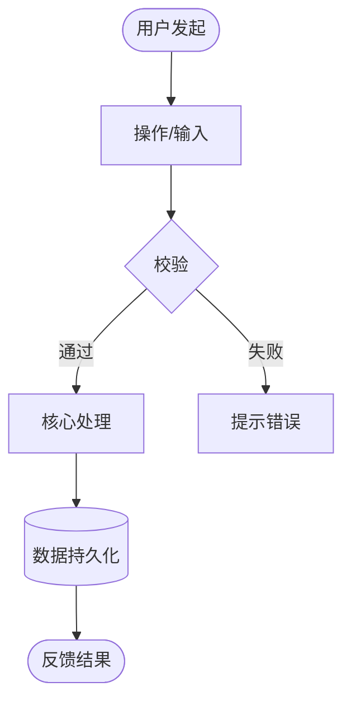
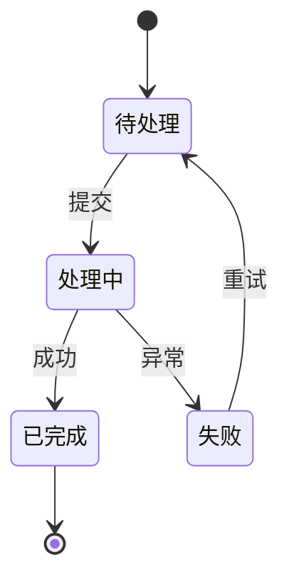
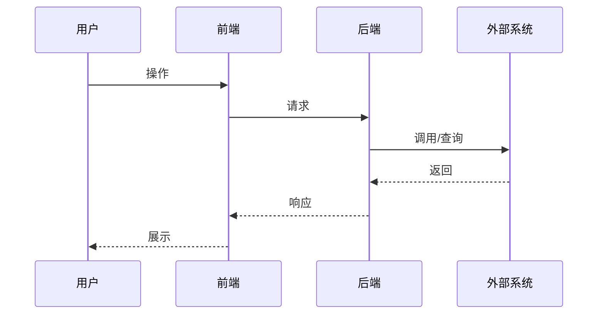
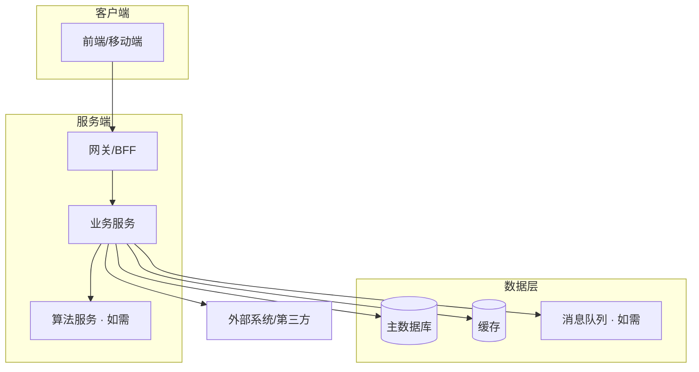
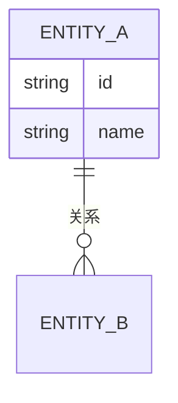

# 输出模板：REQUIREMENT_ANALYSIS.md

生成文档时遵循下面的结构。**按输入丰俭裁剪**：只有零散需求时可精简架构与流程部分，但五大交付物尽量都保留骨架；某项确实无从谈起时省略该节，别填无意义占位。

所有推断性内容（架构、选型、难点判断）必须标注来源属性，需求缺口标注 `【待确认】`。Mermaid 图按项目实际绘制，不要照搬样例数据。

---

## 模板结构

```markdown
# 需求分析：<项目/功能名>

> 本文档由 requirement-analysis 技能生成于 <日期>
> 输入来源：<列出分析所依据的文档，如「PRD v1.2 + 立项文档」或「用户口述需求」>
> 定位：把产品需求翻译成研发视角。架构与难点为**推断建议**，以团队技术评审为准；`【待确认】`项需与产品/业务对齐。
> 涉及研发角色：<如 前端 / 后端 / 算法>

---

## 一、📌 项目简介

<一段话讲清：这个项目是什么、给谁用、解决什么问题、核心价值。控制在 3–5 句，让人 30 秒建立全局认知。>

| 维度 | 内容 |
|------|------|
| 一句话定义 | <是一个做…的系统/功能> |
| 目标用户 | <谁在用> |
| 解决的问题 | <核心痛点> |
| 业务/商业价值 | <为什么值得做> |
| 项目性质 | <新建 / 迭代 / 重构，可选> |

---

## 二、📋 核心需求说明

<不是照抄 PRD，是翻译 + 重新组织。先功能需求，后非功能需求。用工程师能直接理解的语言。>

### 2.1 功能需求

按模块/功能块组织。每个功能点讲清「做什么 + 关键规则 + 边界 + 涉及角色」。

| # | 功能 | 说明（工程视角） | 关键规则 / 边界 | 主要涉及 |
|---|------|----------------|----------------|---------|
| F1 | <功能名> | <翻译后的工程描述，点破隐含的接口/状态/数据流> | <边界条件、异常处理> | 前端/后端/… |
| F2 | | | | |

对复杂功能可展开子说明：
- **F1 <功能名>**：<详细流程，必要时嵌入小流程图或状态说明。若含产品黑话，此处给出翻译，例如「所谓『一键同步』= 前端触发 → 后端建异步任务 → WebSocket 推进度 → 完成后前端刷新」>

### 2.2 非功能需求

| 类别 | 要求 | 备注 |
|------|------|------|
| 性能 | <响应时间 / 吞吐 / FPS> | <缺失则写「未明确，见待确认」> |
| 数据规模 | <量级 / 增速> | |
| 并发 | <并发用户 / QPS> | |
| 安全合规 | <鉴权 / 加密 / 隐私 / 审计> | |
| 兼容性 | <浏览器 / 系统 / 设备> | |
| 可用性 | <SLA / 容灾 / 降级> | |

### 2.3 明确的范围边界

- ✅ **本期要做**：<列出>
- ❌ **本期不做**：<列出文档明确排除的，防止 scope 膨胀；文档没说的写「未界定，见待确认」>

---

## 三、🔀 项目流程图

<把最核心的一两条业务主线画出来。复杂项目拆多张，不要硬塞一张。选合适的图型。>

### 3.1 核心业务流程



### 3.2 关键状态流转（如适用）



### 3.3 关键交互时序（如涉及多系统/实时通信）



---

## 四、🏗️ 架构设计（推断建议）

> ⚠️ 以下架构与选型为**基于需求的推断**，提供一个合理起点与思路，**具体以团队技术评审为准**。若文档已指定技术栈，则顺其推导。

### 4.1 整体架构图



### 4.2 模块/服务职责

| 层/模块 | 职责 | 建议选型（供参考） | 为什么 |
|---------|------|-------------------|--------|
| 前端 | | | |
| 后端服务 | | | |
| 数据存储 | | | |
| 缓存/队列 | | | |
| 外部依赖 | | | |

### 4.3 关键数据实体（如能从需求推断）

<列出核心数据对象及关系，帮助后端建模。可用简单列表或 ER 图。>



---

## 五、⚠️ 实施难点总结（研发视角）

<产品文档通常没有、但工程师最想要的部分。每条尽量带「建议方向」。>

### 5.1 技术难点

| 难点 | 为什么难 | 涉及角色 | 建议方向 |
|------|---------|---------|---------|
| <如 百万级实时数据渲染> | | 前端/数据 | |

### 5.2 需求缺口与待确认（🔴 阻塞项优先）

按影响排序。格式：问题 —— 影响。

- 🔴【待确认】<问题> —— 影响：<阻塞谁/影响什么决策>
- 🟡【待确认】<问题> —— 影响：<…>

### 5.3 性能与规模挑战

- <数据量/并发/时延带来的挑战与初步应对思路>

### 5.4 跨岗位协作点

- <哪些功能需多岗位联调、哪些接口约定要提前拉通>

### 5.5 风险与依赖

- <外部系统、第三方、合规、时间等风险及缓解建议>

---

## 六、给研发的上手建议

- <最重要的 1–3 条：先啃哪块、哪里有坑、建议先和产品确认哪几个点>
```

---

## 生成要点

- **翻译必须真做**：核心需求说明里若还是产品腔或功能罗列，说明没翻译到位。每个复杂功能都要点破背后的工程链路。
- **表格优先**：需求清单、非功能需求、架构职责、难点都用表格，程序员扫读快。
- **Mermaid 必画**：至少一张核心流程图 + 一张架构图；有多系统/实时交互再加时序图；能推断数据实体就加 ER 图。
- **推断要标注属性**：架构/选型/难点判断都带「供参考，以技术评审为准」；需求缺口用 `【待确认】` 并注明影响。
- **待确认清单是重点产出**：宁可多标，别假装需求完整。用 🔴/🟡 标优先级。
- **按输入裁剪**：只有零散需求时，架构和数据实体可只给粗略推断并显式说明不确定性；不要用编造填满模板。
- **语言**：正文中文，技术名词/接口/标识符保留英文。
